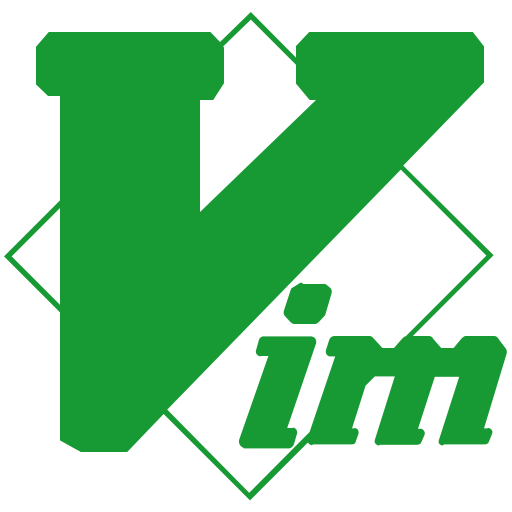

# VimGodot

  
  
<em>Experience the power of Vim in the Godot Script Editor</em>

## 🚀 Introduction

VimGodot is a plugin that brings the powerful features of Vim to the Godot game engine's script editor. It allows developers to improve their productivity by using familiar Vim keybindings and commands directly within Godot.

## 🔥 Features

* **Vim Keybindings**: Supports various Vim modes, including Normal, Insert, and Visual modes.
* **Command Mode**: Use Vim-style commands to quickly navigate files, edit code, save changes, and more.
* **Customizable**: Customize keybindings and settings to suit your workflow.

## 🛠 Custom Configuration

* `res://addons/VimGodot/conf/key_maping.json`: The keybinding configuration file for VimGodot. Edit this file to customize your keybindings.
* `res://addons/VimGodot/conf/keys_white_list.json`: Add specific keys to the whitelist to make VimGodot ignore those key inputs.
* After changing the settings, restart the Godot editor or run the **"VimGodot: Reload Settings"** command from the Command Palette to apply the changes.
* For more information about configuration, see [setting.md](docs/setting.md).

### 🎵 Special Thanks

* [godot-vim](https://github.com/joshnajera/godot-vim): This project was inspired by godot-vim.

## 📄 License

This project is distributed under the [MIT License](LICENSE).